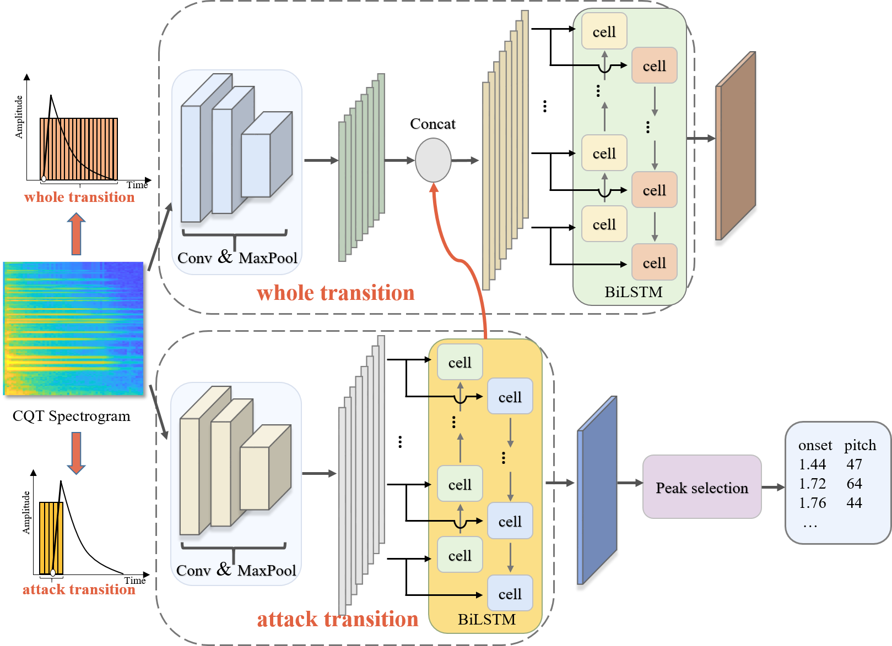

# Transition-aware
**Transition-aware** is an CRNN-based piano transcription model, inferring onset, pitch of 88 notes from raw audios. Compared with the existing models, like [**Onsets and Frames**](https://github.com/magenta/magenta/tree/master/magenta/models/onsets_frames_transcription) and [**High-resolution**](https://github.com/qiuqiangkong/piano_transcription_inference), Transition-aware is a more stable and robust approach as mentioned in our paper.



In this repository, the **inference code** of **Transition-aware** model and 50 pieces music of **OMAPS dataset** are provided. The training part of our code and the complete OMAPS dataset will be available when the paper is published.  More details about **OMAPS (Ordinary MIDI Aligned Piano Sounds)** dataset will be introduced at the end of this document.

## Installation
Transition-aware model is developed with python3.6, tensorflow-gpu1.10, and other python packages. The development environment dependencies can be easily installed simply by running the following command. You'd better use Anaconda to create a new virtual environment for installation.
```bash
pip install -r requirements.txt
```

## Usage
1. First you need to clone this repository

   ```bash
   git clone git@github.com:itec-hust/transition-aware.git
   ```

   This will take a time for our model's checkpoint files and half of our OMAPS dataset are in this repository. 

   After download this repository,  decompress the compressed package under the **checkpoint folder** to get the **onset** and **pitch** files containing the checkpoint file, and then copy the two folders to the **code/checkpoint** folder. The 50 pieces music of OMAPS dataset is under the OMAPS folder. You can look it first if you are interested in it.

   

   Please **cd to code/** before beginning each step below.

2. Transcribe the onset-event probabilities.

   ```bash
   python predict_onset.py --ckpt_path="checkpoint/onset/model.ckpt-218000" --audio_dir="your audio path" --predict_dir="your path to save tfrecords" --save_raw_dir="your path to save onset-event probabilities"
   ```

2. Transcribe the onset probabilities of 88 notes.

   ```bash
   python predict_pitch.py --ckpt_path="checkpoint/pitch/model.ckpt-204000" --audio_dir="your audio path" --predict_dir="your path to save tfrecords" --save_raw_dir="your path to save onset probabilities"
   ```
3. Using peak selection to get the final (onset, pitch) sequence from the onset-event probabilities and onset probabilities.

   ```bash
   python raw_res.py --result_path="your path to save the results" --raw_onset_path="your path to save onset-event probabilities" --raw_pitch_path="your path to save onset probabilities"
   ```
4. Evaluate our model's performance on a dataset.

   ```bash
   python eval_result.py --label_path="your label path" --result_path="your path to save the results"
   ```

   Your labels must be in the text format, with (onset, offset, pitch) three columns. If your label is in the MIDI format, use our **code/convert_midi_to_txt.py** first to get the text format label.

   ```bash
   python convert_midi_to_txt.py --midi_path="your midi label path" --txt_path="your path to save the text format label"
   ```


## OMAPS dataset

**OMAPS** dataset stands for **Ordinary MIDI Aligned Piano Sounds** dataset. OMAPS dataset is recorded from an ordinary electronic Yamaha piano P-115 played by a professional musician under the general recording environment. The MIDI derived from the electronic piano is used as the annotation. This dataset contains 106 pieces of different music, a total of 216 minutes. It is used to evaluate the performance of piano transcription algorithms in an **ordinary recording environment**.  OMAPS dataset is not intended to replace the existing piano transcription dataset MAESTRO or MAPS, but is developed for our multi modal transcription research of video and audio fusion.  The complete OMAPS dataset contains audio and video, but at present we only open source audio part and labels.

Here is a picture of our recording environment. Yamaha P-115 piano and  logitech C922 PRO HD stream webcam are used for recording in an quiet room.  The sampling rate of our audio is 44100 Hz and quality of our  video is 1080P/30fps. You can have a look at OMAPS dataset under the OMAPS folder of this repository. The complete audio part of OMAPS dataset will be available when the paper is published. 50 pieces of music and labels are provided now!


This is an sample of our OMAPS dataset. It may not be displayed on GitHub. You can download and listen to it.

<audio id="audio" controls="" preload="none">
   <source id="mp3" src="OMAPS/001.mp3">
</audio>